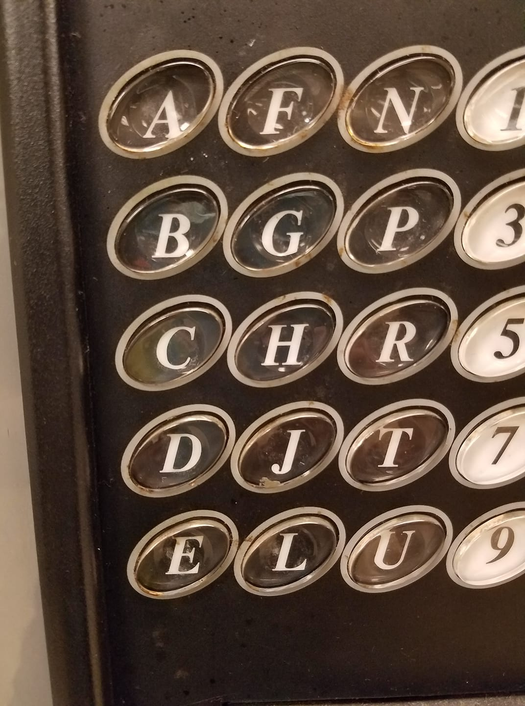

# ikmoqsvwxyz

The letters "ikmoqsvwxyz" are missing from a photo that somebody posted on
Facebook (photo below). As would be expected, people started to type messages excluding these letters in the thread (okay it was mostly me). I decided to write a program to automate this process, and also help decipher text written this wqay.

## Usage

### Running
This is not a GUI program, it is a CLI program. What this means is you need to
run the program from inside Command Prompt. If you're using Linux you already
know what to do. If you're using Mac OS then you're used to this treatment.

Make sure "words_dictionary.json" is included in the working directory.
This file [can be found here](https://github.com/dwyl/english-words/).
Releases will have this file included.

### Finding matches
1. Wait for the `>` prompt
2. Type something short that's missing "ikmoqsvwxyz"
3. The program should display a list of possibilities for each word

### Removing `ikmoqsvwxyz`
1. Wait for the `>` prompt
2. Type `run-command short <text>`, replacing `<text>` with text you want to
   obfuscate. Spaces are allowed and quotes are not necessary.
3. The prgra huld dpla ablute nnene.

## Contributions
Yes. The most interesting contribution would be to try and find likely
sentences after matching words are found.

